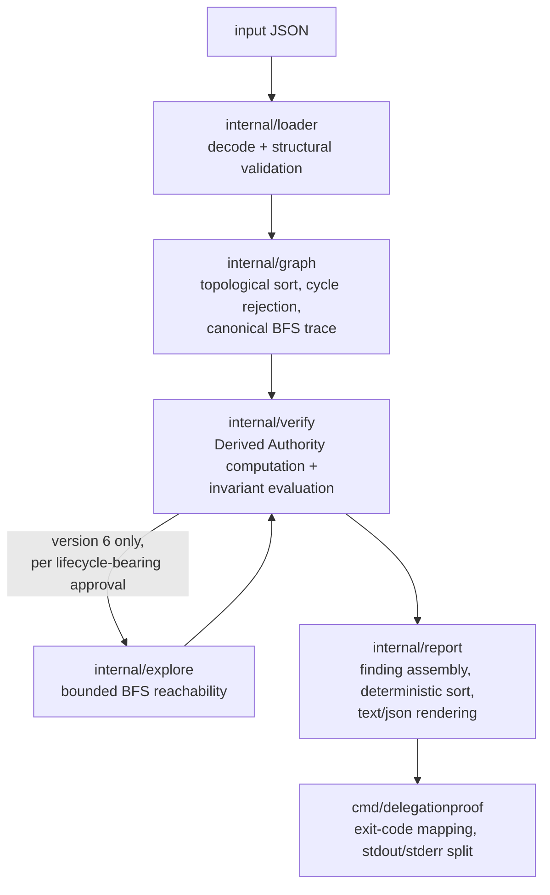

# Architecture

This is the standalone, linkable architecture document for
DelegationProof. The [README](../README.md) carries a short summary and
links here for the full picture; this document is the expanded version
for a reviewer who wants to understand the pipeline and package
boundaries without reading all six `docs/phase-*-plan.md` design
contracts end to end.

## Pipeline overview

```
input JSON
    ↓
internal/loader   (decode + full structural validation, one file per version)
    ↓
internal/graph    (Kahn's-algorithm topological sort, cycle rejection, canonical BFS trace)
    ↓
internal/verify   (version-specific Derived Authority computation + invariant evaluation)
    ↓
internal/explore  (bounded, deterministic BFS reachability — version 6 only, lifecycle safety)
    ↓
internal/report   (finding assembly, deterministic sort, text/json rendering)
    ↓
cmd/delegationproof (exit-code mapping, stdout/stderr split)
```

- **`internal/loader`** decodes the input JSON and runs every structural
  validation rule for the document's declared schema version — JSON
  syntax errors and unknown-field decode errors abort immediately
  (they make the document unparseable at all), but every other
  structural problem is collected and reported together, not fail-fast
  (`docs/phase-1-plan.md` §7.4). A document that fails loading never
  reaches any later stage.
- **`internal/graph`** takes the now-structurally-valid document and
  computes a topological order over the delegation graph using Kahn's
  algorithm, rejecting cycles as a structural error, and provides the
  canonical (tie-broken, deterministic) BFS trace used to explain a
  finding's delegation path.
- **`internal/verify`** walks nodes in that topological order, computing
  each node's Derived Authority from its valid incoming edges only (an
  invalid edge contributes nothing — strict distrust, no partial
  credit), then evaluates every operation and delegation edge against
  every invariant applicable to the document's schema version, in the
  precedence order each phase plan defines. This is where all six
  invariants actually live, one `Run*` entry point per schema version.
- **`internal/explore`** is invoked only by version 6's verifier, once
  per lifecycle-bearing approval record, to answer "can this approval's
  own declared state automaton ever reach a state other than
  `approved`?" via a bounded, deterministic breadth-first search.
- **`internal/report`** assembles the findings `internal/verify`
  produces into the finding contract, sorts them by a fixed total order,
  and renders either the human-readable `text` format or the
  machine-readable `json` format.
- **`cmd/delegationproof`** is the only package that touches `os.Args`,
  `stdout`, or `stderr`. It dispatches `validate`/`verify`/`--version`,
  maps the outcome onto one of the four exit codes
  (`internal/exitcode`), and enforces the stdout/stderr split: result
  output only ever goes to stdout, diagnostics/errors only ever go to
  stderr.

## Pipeline diagram



## Package responsibilities

| Package | Responsibility | Why this boundary exists |
|---|---|---|
| `internal/model` | Pure data types per schema version (`types.go` … `types_v6.go`), no logic. | Keeps every version's shape structurally disjoint — a version-1 document can never be accidentally interpreted under version-2+ semantics. |
| `internal/limits` | Resource-bound constants, exported `var`s. | Tests can lower a bound to construct a small fixture that exceeds it, without generating a pathologically large input file. |
| `internal/loader` | JSON decode + full structural validation, one file per schema version. | The sole schema authority — `schemas/model.md` is documentation, not a validation library dependency. Version dispatch happens here (see below). |
| `internal/graph` | DAG topological sort (Kahn's algorithm), cycle detection, canonical BFS trace. Shared by every schema version. | A delegation graph must be acyclic; this is the one place that's enforced and the one place the canonical trace-finding algorithm lives, so every version's finding explanations use identical trace semantics. |
| `internal/explore` | Generic bounded, deterministic BFS reachability over a possibly-cyclic labeled digraph. Version 6 only. | Deliberately **not** folded into `internal/graph`: `graph.TopoSort` exists specifically to *reject* cycles as a structural error, while a version-6 lifecycle automaton is explicitly, legitimately allowed to contain them. `internal/explore` has zero dependency on `model`, `report`, or `loader` — it operates purely on strings and a transition list, independently unit-tested with no DelegationProof-specific scaffolding. |
| `internal/verify` | Derived Authority computation, edge/operation evaluation, finding construction — one `Run*` function per schema version. | Where all six invariants and their documented precedence chains actually live. Each version's verifier is structurally disjoint from the others, so adding a phase never modifies an earlier phase's production code path. |
| `internal/report` | Finding types, deterministic sort order, `text`/`json` renderers. | Separates "what was found" (`internal/verify`'s job) from "how it's presented" — both output formats are produced from the same finding data, never re-derived. |
| `internal/exitcode` | The four-value CLI exit-code type. | Single source of truth `cmd/delegationproof` maps every outcome onto, so the exit-code contract can't drift between subcommands. |
| `cmd/delegationproof` | CLI entry point: arg parsing, `--version` handling, exit-code mapping, stdout/stderr split. | The only package that touches process I/O — every other package is a pure function of its input, which is what makes the whole pipeline deterministic and independently unit-testable. |

## Determinism mechanisms

Identical input always produces byte-identical output, and reordering
any array in a semantically-equivalent model never changes it. In brief
(see the README's "Determinism" section for the full mechanism list,
mirrored there rather than duplicated at length here to avoid the two
copies drifting apart):

- Kahn's-algorithm topological sort and every trace-finding BFS break
  ties by ascending lexicographic node id, never by map iteration order.
- Findings are sorted by a fixed total order over their own content.
- Multi-path computations (version 4's remaining-delegation-budget
  maximum, version 5's approval-requirement OR, version 6's canonical
  unsafe-state selection) use commutative/associative/idempotent
  operations or an explicit, documented tie-break — never an arbitrary
  "first one found."
- The one place a computation ever ranges a Go `map`, its result is
  sorted before anything is read from it.

## Version dispatch

`internal/loader.LoadDocument` peeks at the input's top-level
`{"version": string}` field before committing to any struct shape, then
decodes into the schema-version-specific model type and runs that
version's own validation rules. Because `internal/model`,
`internal/loader`, and `internal/verify` each define one file per
version with no shared mutable state between them, adding a new
invariant (a new phase) never risks silently changing an earlier
version's decode or evaluation behavior — the only code shared across
every version is deliberately generic infrastructure
(`internal/graph`, `internal/report`'s sort/render machinery,
`internal/explore`) that has no version-specific logic to get wrong.

## Complexity

The whole pipeline is `O(nodes + edges + operations)`: one topological
pass computes every node's Derived Authority with no backtracking and no
search; the canonical BFS trace for a finding is one linear pass over
already-validated edges; version 6's lifecycle exploration is bounded
and run once per approval record, never composed into a cross-product
global state, so its total cost is linear in the number of declared
approvals. See `docs/evidence-report.md` §7 for the tests that exercise
every resource bound this complexity claim depends on.
